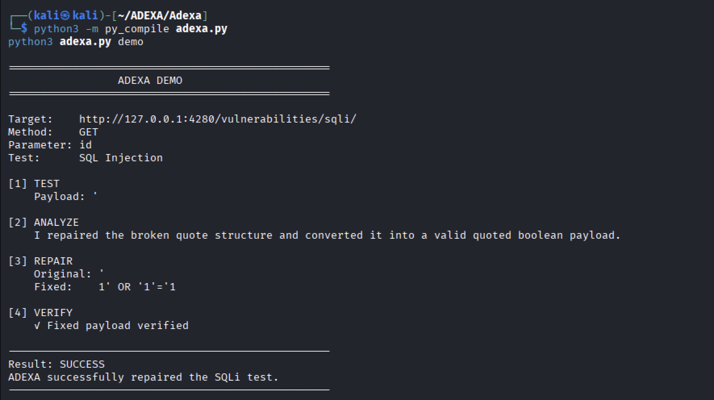
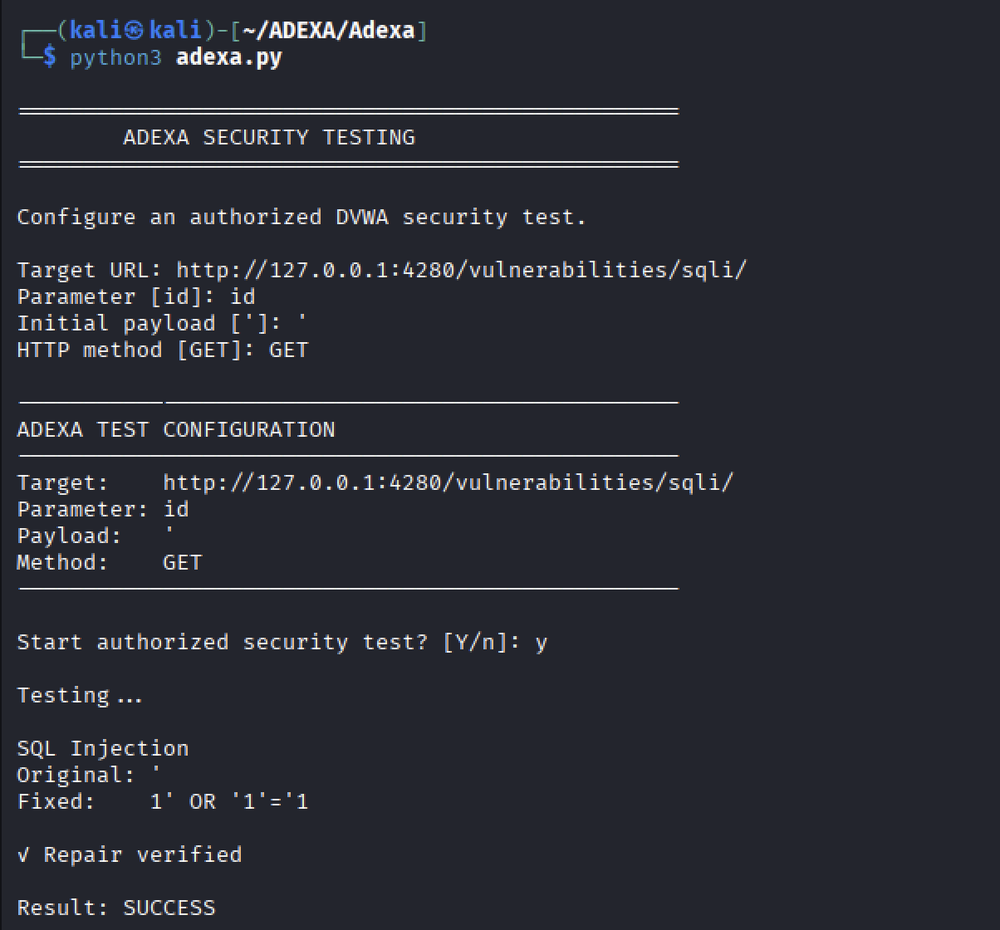

Yes. I’d rewrite the **entire README**, but preserve the useful technical documentation underneath the new opening.

Below is the version I would use.

````markdown
# ADEXA

> [!WARNING]
> **AUTHORIZED SECURITY TESTING ONLY**
>
> ADEXA is intended exclusively for cybersecurity research, education, controlled laboratory environments, and security testing performed with explicit authorization.
>
> **Do not use ADEXA against systems, applications, networks, or infrastructure without explicit permission from the owner.**

## Adaptive Security Testing

**ADEXA explores what should happen when a security-testing attempt fails.**

Instead of treating a failed payload as the end of a test, ADEXA analyzes the failure, adapts its next decision, repairs or changes the candidate, re-tests it, and verifies whether the result actually worked.

```text
Execute
   ↓
Observe
   ↓
Analyze
   ↓
Repair
   ↓
Re-test
   ↓
Verify
   ↓
Decide what to do next
````

**Current proving ground:** SQL injection in controlled environments
**Status:** Research-stage prototype — active development

---

# What is ADEXA?

ADEXA is an AI-assisted adaptive security-testing framework.

Its research focus is not simply:

> **"Can I generate another payload?"**

Instead, ADEXA focuses on:

> **"What should I do after the security-testing attempt fails?"**

A failed attempt contains information.

The application response, failure type, execution context, previous attempts, and verification evidence can all influence what should happen next.

ADEXA is designed to use that information to make the next testing decision.

---

# The Problem

A typical automated security-testing workflow can look like:

```text
Payload
   ↓
Execute
   ↓
Result
   ↓
Success / Failure
```

When the attempt fails, a security tester may need to manually determine:

* Why did it fail?
* Was the payload malformed?
* Was the testing assumption wrong?
* Should the same approach be modified?
* Has this candidate already failed?
* Should a different strategy be used?
* Is there enough evidence to call the next attempt successful?

ADEXA explores whether part of this **between-attempt decision-making** can be automated.

The goal is not simply to produce more payloads.

The goal is to make the testing process **adaptive**.

---

# What Makes ADEXA Different?

ADEXA is built around what happens **between failed attempts**.

### 1. It learns from failed attempts

ADEXA keeps track of previous attempts and can avoid selecting candidates that have already failed.

```text
Attempt A
   ↓
Failure
   ↓
Remember result
   ↓
Do not blindly repeat A
```

### 2. It uses evidence when ranking candidates

Candidate selection can take into account information such as:

* previous attempts,
* observed failure behavior,
* syntax/context,
* repair strategy,
* and whether a candidate has already been tested.

The objective is not simply to cycle through a static payload list.

### 3. It can change strategy

If one repair approach becomes exhausted or repeatedly fails, ADEXA can move toward another strategy.

Conceptually:

```text
Boolean strategy
      ↓
Repeated failures
      ↓
Strategy exhausted
      ↓
Change approach
      ↓
Time-based strategy
```

### 4. It verifies instead of assuming success

A repaired payload is not considered successful simply because it looks valid.

ADEXA executes the candidate and uses verification evidence before declaring the result successful.

```text
Candidate generated
       ↓
Candidate executed
       ↓
Evidence collected
       ↓
Verification
       ↓
Success / Failure
```

### 5. It can stop intelligently

Not every failure should result in another attempt.

ADEXA can use the state of the current repair process to determine whether it should:

* continue,
* change strategy,
* or stop.

The goal is to avoid endless retries and unnecessary repetition.

### 6. It explains decisions

ADEXA records information about decisions such as:

* selected candidate,
* repair strategy,
* selection reasoning,
* previous memory usage,
* verification result,
* and final state.

This makes the adaptive process inspectable rather than hiding it behind a single "AI found a payload" result.

---

# ADEXA vs. "Just Another Automated Pentesting Tool"

ADEXA is **not intended to be a smaller replacement for established automated security-testing tools**.

Its current research question is different.

```text
Traditional automation

Test
 ↓
Try payloads
 ↓
Find result


ADEXA

Test
 ↓
Observe
 ↓
Understand failure
 ↓
Adapt decision
 ↓
Repair / change strategy
 ↓
Re-test
 ↓
Verify
```

ADEXA's value is therefore centered on the **adaptive layer between testing attempts**.

In the long term, this architecture could complement existing security-testing tools rather than simply attempting to replace them.

---

# What Can ADEXA Actually Do Today?

ADEXA is currently focused on **SQL injection as its proving ground**.

In controlled environments, the current implementation can:

* analyze unsuccessful SQL injection attempts;
* repair malformed payloads;
* work with Boolean-based SQLi strategies;
* work with time-based SQLi strategies;
* generate repair candidates;
* rank candidates;
* avoid previously failed candidates;
* change strategy when an approach is exhausted;
* execute repaired candidates;
* verify results;
* use relevant previous repair information;
* record decisions and execution artifacts;
* run through the CLI;
* run through a GUI connected to the same execution engine.

SQL injection is the **current proving ground for the adaptive architecture**, not the intended permanent limitation of ADEXA.

---

# See the Adaptive Loop

ADEXA's core process is:

```text
                    ┌───────────────┐
                    │ Initial Test  │
                    └───────┬───────┘
                            │
                            ▼
                       ┌─────────┐
                       │ Execute │
                       └────┬────┘
                            │
                            ▼
                       ┌─────────┐
                       │ Observe │
                       └────┬────┘
                            │
                            ▼
                       ┌─────────┐
                       │ Analyze │
                       └────┬────┘
                            │
                            ▼
                       ┌────────┐
                       │ Repair │
                       └────┬───┘
                            │
                            ▼
                       ┌────────┐
                       │ Re-test│
                       └────┬───┘
                            │
                            ▼
                       ┌────────┐
                       │ Verify │
                       └────┬───┘
                            │
                  ┌─────────┴─────────┐
                  │                   │
                SUCCESS             FAILURE
                  │                   │
                  ▼                   ▼
             Store result       Analyze new evidence
                                      │
                                      ▼
                               Next decision
```

The important part is the loop.

ADEXA does not treat every attempt as an isolated event.

---

# Example

In a controlled DVWA laboratory, ADEXA can start with an unsuccessful SQL injection payload such as:

```text
'
```

ADEXA analyzes the failure and can select a repaired candidate such as:

```text
1' OR '1'='1
```

The important part is not simply that ADEXA generated this string.

The process is:

```text
Broken attempt
     ↓
Observe failure
     ↓
Analyze context
     ↓
Select repair strategy
     ↓
Generate candidate
     ↓
Execute candidate
     ↓
Verify result
```

A successful candidate must still pass the verification stage.

---

# Demo

ADEXA includes a controlled DVWA demonstration.

Run:

```bash
python3 adexa.py demo
```

The demonstration shows the adaptive SQL injection repair workflow against the local DVWA laboratory.

<p align="center">
  
</p>

<p align="center">
  <em>ADEXA repairing and verifying a SQL injection payload against the local DVWA laboratory.</em>
</p>

---

# GUI

ADEXA also includes a graphical interface connected directly to the same ADEXA execution engine.

The GUI provides:

* New Test configuration
* Execute → Observe → Analyze → Repair → Verify progress
* Verification results
* Repaired payload information
* Test History
* Run Details
* Technical execution output

The GUI is **not a simulated demonstration**. It launches the actual ADEXA testing workflow.

### Launch the GUI

From a fresh clone:

```bash
git clone https://github.com/David-Axel/Adexa.git
cd Adexa

python3 -m venv .venv
source .venv/bin/activate

pip install -r requirements-gui.txt

python3 gui.py
```

> **Safety:** The GUI is intended only for authorized security testing and controlled laboratory environments.

---

# How the Adaptive Decision Process Works

ADEXA combines deterministic security-testing logic with AI-assisted decision making.

Conceptually:

```text
Failed Attempt
      │
      ▼
Observed Evidence
      │
      ▼
Failure Analysis
      │
      ▼
Repair Strategy
      │
      ▼
Candidate Generation
      │
      ▼
Candidate Ranking
      │
      ▼
Execution
      │
      ▼
Verification
```

The AI layer can assist with:

* interpreting failure information;
* selecting repair strategies;
* generating repair candidates;
* ranking candidates;
* and using relevant previous cases.

The AI layer does **not** define success by itself.

A candidate must still pass ADEXA's execution and verification process.

---

# Repair Memory

ADEXA includes a repair-memory mechanism.

The purpose is to avoid treating every failure as completely independent.

```text
Attempt
   ↓
Analyze
   ↓
Repair
   ↓
Verify
   ↓
Successful result
   ↓
Store useful information
   ↓
Reuse when relevant
```

Memory can also help ADEXA avoid repeating previously unsuccessful candidates.

The objective is not simply to accumulate more data.

The objective is to make previous experience useful when it is relevant to the current decision.

---

# Architecture

ADEXA is built around an adaptive execution loop connecting execution backends, analysis and AI components, verification logic, repair memory, and structured logging.

<p align="center">
  
</p>

<p align="center">
  <em>ADEXA adaptive security testing architecture.</em>
</p>

Main components:

* **Core Adaptive Loop** — coordinates execution, observation, analysis, repair, re-testing, and verification.
* **Execution Backends** — interact with controlled web and experimental binary targets.
* **AI Engine** — assists with failure analysis, repair decisions, candidate generation, and scoring.
* **Verification Engine** — determines whether a repaired candidate actually succeeds.
* **Repair Memory** — retains useful previous repair information.
* **Run Storage & Logging** — records iterations, decisions, observations, and artifacts.

---

# Current SQL Injection Focus

SQL injection is currently ADEXA's primary web-testing proving ground.

The current implementation focuses on SQLi repair and verification in controlled environments such as DVWA.

Current SQLi work includes:

* malformed payload analysis;
* syntax and quotation repair;
* Boolean-based SQLi adaptation;
* time-based SQLi adaptation;
* candidate generation;
* candidate scoring;
* automated execution;
* exploit verification;
* previous-repair reuse;
* failed-candidate avoidance;
* strategy switching;
* and structured iteration logging.

The reason for focusing on SQLi is to **prove and measure the adaptive architecture deeply before generalizing it to other security-testing workflows**.

---

# Installation

## Prerequisites

ADEXA is currently developed and tested primarily on Linux/Kali Linux.

You will need:

* Python 3
* Git
* Docker
* Docker Compose

For experimental binary-analysis functionality:

* GDB

For supported local AI-assisted functionality:

* Ollama

---

# Quick Start

### 1. Clone ADEXA

```bash
git clone https://github.com/David-Axel/Adexa.git
cd Adexa
```

### 2. Run the setup script

```bash
chmod +x setup.sh
./setup.sh
```

The setup script checks for the required tools, creates the Python environment, installs dependencies, starts the local DVWA laboratory, and initializes DVWA.

DVWA will be available locally at:

```text
http://127.0.0.1:4280
```

### 3. Check the environment

Run:

```bash
python3 adexa.py doctor
```

Doctor checks:

* Python
* Python dependencies
* Docker
* Docker Compose
* ADEXA setup files
* DVWA connectivity

A healthy environment should show:

```text
✓ Python 3.13
✓ Python dependencies
✓ Docker is running
✓ Docker Compose
✓ ADEXA setup files
✓ DVWA is reachable

✓ ADEXA environment is ready.
```

### 4. Run the demonstration

```bash
python3 adexa.py demo
```

### 5. Start ADEXA

For beginners:

```bash
python3 adexa.py
```

For advanced usage:

```bash
python3 adexa.py \
  --url http://127.0.0.1:4280/vulnerabilities/sqli/ \
  --param id \
  --payload "'" \
  --method GET
```


> **Safety:** DVWA is intentionally vulnerable. The included laboratory is bound to `127.0.0.1` and should only be used for authorized security research, education, and controlled testing.

---

# Usage

> **Authorization Required:** The commands and examples below are intended only for systems you own or have explicit authorization to test.

## Guided Mode

Guided Mode is recommended for new users:

```bash
python3 adexa.py
```

ADEXA asks for the basic configuration:

```text
Target URL:
Parameter [id]:
Initial payload [']:
HTTP method [GET]:
```

It then displays the configuration and asks for confirmation before starting the authorized test.

<p align="center">
  
</p>

<p align="center">
  <em>ADEXA guided CLI for configuring an authorized security test.</em>
</p>

---

## Advanced Mode

Experienced users can provide the configuration directly:

```bash
python3 adexa.py \
  --url http://127.0.0.1:4280/vulnerabilities/sqli/ \
  --param id \
  --payload "'" \
  --method GET
```

Advanced Mode provides detailed execution information, including:

* candidate payloads;
* selected payload;
* selection reasoning;
* AI decision;
* repair-memory information;
* execution artifacts;
* and verification results.

---

## Environment Check

```bash
python3 adexa.py doctor
```

---

## Demonstration

```bash
python3 adexa.py demo
```

---

# Web / SQL Injection Workflow

During a web execution, ADEXA can:

1. receive the target and initial payload;
2. generate a temporary PoC specification;
3. execute the payload;
4. observe the target response;
5. analyze the unsuccessful attempt;
6. select a repair strategy;
7. generate a candidate;
8. execute the candidate;
9. verify the result;
10. store execution artifacts.

The important distinction is that the next attempt can be influenced by what happened during the previous attempt.

---

# Direct Core Execution

The lower-level execution engine can also be invoked directly:

```bash
python3 main.py <poc_spec.json> <web|binary>
```

Example:

```bash
python3 main.py poc_specs/dvwa_demo.json web
```

For normal interaction with ADEXA, `adexa.py` should generally be used instead.

---

# Benchmark

ADEXA includes a benchmark script for evaluating the repair pipeline:

```bash
python3 benchmark_adexa.py
```

The benchmark can evaluate:

* repair success;
* verification success;
* payload-family preservation;
* strategy selection;
* memory usage;
* repair quality;
* and candidate diversity.

The longer-term evaluation question is:

> **Can ADEXA successfully adapt to SQL injection failures it has not previously seen?**

That is more important than simply measuring how many known examples it can reproduce.

---

# Evaluation

ADEXA is evaluated on more than whether it can generate another payload.

Important metrics include:

* repair success rate;
* verification success rate;
* payload-family preservation;
* number of repair iterations;
* repeated-candidate rate;
* strategy switching;
* repair-memory usage;
* candidate diversity;
* repair quality;
* and performance on previously unseen cases.

A major research objective is to evaluate ADEXA's AI-assisted repair capabilities against simpler baseline approaches on **held-out, unseen SQL injection cases**.

---

# Testing

ADEXA uses `pytest` for automated testing.

Run:

```bash
python3 -m pytest -q
```

The test suite covers areas including:

* SQL injection repair strategies;
* candidate generation;
* candidate scoring;
* payload normalization;
* repair-memory behavior;
* web request parsing;
* and adaptive decision behavior.

Some tests may require the local DVWA laboratory.

Start DVWA with:

```bash
docker compose -f compose.yml up -d
```

Then run:

```bash
python3 -m pytest -q
```

---

# Execution Logs

ADEXA creates structured execution artifacts for individual runs.

Runtime information is stored under:

```text
runs/
```

Depending on the execution, artifacts can contain:

```text
Run
├── Original Payload
├── Observation
├── Failure Information
├── AI Decision
├── Repair Strategy
├── Candidate Payload
├── Verification Result
└── Final State
```

Runtime-generated files are excluded from Git through `.gitignore`.

---

# Project Structure

```text
ADEXA/
├── ai_engine/
│   ├── crash_ai.py
│   ├── exploit_rewriter.py
│   ├── exploit_scorer.py
│   ├── poc_ai.py
│   └── repair_memory.py
│
├── backends/
│   ├── binary_backend.py
│   └── web_backend.py
│
├── core/
│   ├── loop_controller.py
│   ├── models.py
│   └── run_store.py
│
├── dataset/
├── debugger/
│   ├── crash_parser.py
│   ├── gdb_runner.py
│   └── offset_finder.py
│
├── docs/
│   └── images/
│
├── exploit_tests/
├── gui/
├── poc_specs/
├── scripts/
│   └── setup_dvwa.sh
├── utils/
├── web_engine/
│
├── adexa.py
├── main.py
├── benchmark_adexa.py
├── compose.yml
├── requirements.txt
├── setup.sh
└── README.md
```

### Main Components

| Component        | Purpose                                                             |
| ---------------- | ------------------------------------------------------------------- |
| `ai_engine/`     | AI-assisted failure analysis, repair decisions, scoring, and memory |
| `backends/`      | Web and experimental binary execution                               |
| `core/`          | Adaptive loop, internal models, and run storage                     |
| `dataset/`       | Dataset validation and evaluation tooling                           |
| `debugger/`      | Crash parsing, GDB execution, and offset analysis                   |
| `exploit_tests/` | Controlled local exploit-testing material                           |
| `poc_specs/`     | Proof-of-concept specifications                                     |
| `web_engine/`    | Web vulnerability-analysis components                               |
| `gui/`           | Graphical interface components                                      |
| `scripts/`       | Local laboratory setup scripts                                      |
| `compose.yml`    | Docker-based DVWA and MariaDB laboratory                            |
| `setup.sh`       | Automated ADEXA and laboratory setup                                |

---

# Experimental Binary Support

ADEXA also contains experimental components for binary exploit analysis and repair.

These components investigate:

* debugger integration;
* crash analysis;
* offset discovery;
* exploit rewriting;
* candidate execution;
* and verification.

Binary support remains experimental and is **not currently the primary development focus**.

The current research effort is concentrated on proving the adaptive architecture through SQL injection.

---

# Research Direction

ADEXA is currently a **research-stage prototype**, not a finished commercial penetration-testing platform.

The current strategy is deliberately narrow:

```text
Adaptive architecture
        ↓
Deep SQLi evaluation
        ↓
Measure what works
        ↓
Understand limitations
        ↓
Generalize the architecture
        ↓
Explore additional security-testing workflows
```

Potential future research areas may include:

* Cross-Site Scripting (XSS)
* Command Injection
* Server-Side Request Forgery (SSRF)
* authentication and session testing
* access-control testing
* API security testing
* other security-testing workflows where adapting after failure is useful

These are **future research directions**, not claims about current ADEXA capabilities.

The long-term goal is not necessarily to replace existing security tools.

ADEXA could instead provide an **adaptive decision layer** that complements established testing workflows:

```text
Existing Security Tool
        ↓
Testing Attempt
        ↓
Failure / Evidence
        ↓
       ADEXA
        ↓
Adaptive Decision
        ↓
Re-test
        ↓
Verification
```

---

# Responsible Use

ADEXA is intended exclusively for:

* cybersecurity research;
* educational environments;
* controlled laboratories;
* CTF-style environments;
* vulnerability research;
* and systems where the tester has explicit authorization.

The included DVWA environment is intentionally vulnerable and exists solely for controlled security research and development.

**Do not use ADEXA against systems without permission.**

Users are responsible for ensuring that their activities comply with applicable laws, policies, and authorization requirements.

---

# Contributing

ADEXA is an active research project and contributions are welcome.

Useful contributions include:

* improving adaptive decision logic;
* improving failure analysis;
* improving verification;
* improving test coverage;
* evaluating unseen cases;
* identifying weaknesses in current assumptions;
* improving documentation;
* and experimenting with new research directions.

When contributing, prefer changes that **improve the existing adaptive behavior** rather than simply adding functionality.

---

# License

ADEXA is distributed under the terms provided in the [`LICENSE`](LICENSE) file.

---

# Author

**David-Axel Kacou**

Cybersecurity & Digital Forensics

---

> **ADEXA is an experimental research project under active development. It should not currently be considered a production-ready penetration-testing platform.**

```

